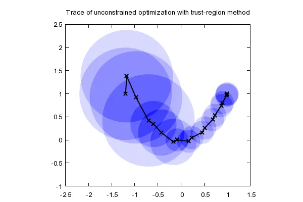
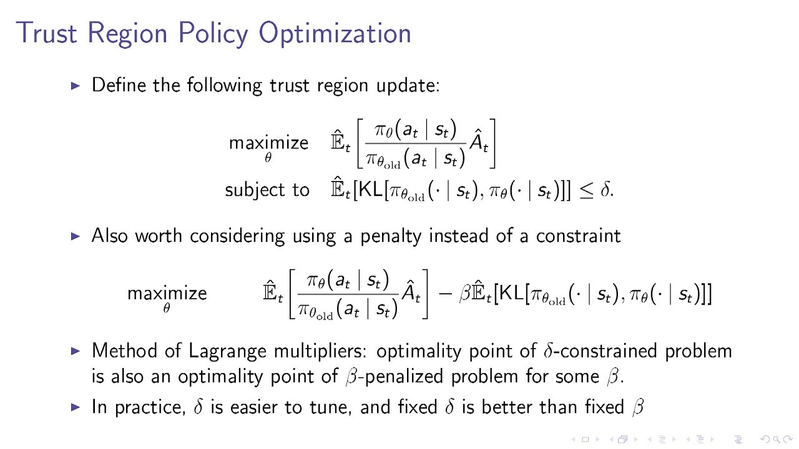

<!--
*** Thanks for checking out the Best-README-Template. If you have a suggestion
*** that would make this better, please fork the repo and create a pull request
*** or simply open an issue with the tag "enhancement".
*** Thanks again! Now go create something AMAZING! :D
***
***
***
*** To avoid retyping too much info. Do a search and replace for the following:
*** the-guti, rgtzgn@gmail.com, federated learning, reinforcement learning
-->

<!-- PROJECT SHIELDS -->
<!--
*** I'm using markdown "reference style" links for readability.
*** Reference links are enclosed in brackets [ ] instead of parentheses ( ).
*** See the bottom of this document for the declaration of the reference variables
*** for contributors-url, forks-url, etc. This is an optional, concise syntax you may use.
*** https://www.markdownguide.org/basic-syntax/#reference-style-links
-->

<!-- PROJECT LOGO -->
 

  

  <h3 align="center">FL-TRPO Microgrid Management</h3>

  

    A FL implementation of TRPO in energy microgrids.
     
    <a href="https://github.com/banma12956/FRL/issues">Report Bug or Request Feature</a>
  

<!-- TABLE OF CONTENTS -->

  
<h2 style="display: inline-block">Table of Contents</h2>

  <ol>
    <li>
      <a href="#about-the-project">About The Project</a>
    </li>
    <li><a href="#maths">Math</a></li>
    <li><a href="#contact">Contact</a></li>
    <li><a href="#acknowledgements">Acknowledgements</a></li>
  </ol>

<!-- ABOUT THE PROJECT -->
## About The Project

TRPO optimization algorithm applied in federated learning framework for Microgrid management .

<!-- MATH -->
## Maths

<!-- CONTACT -->
## Contact

Yunxiang Li - 1718613239banma@gmail.com

Roberto Guillen - rgtzgn@gmail.com

<!-- ACKNOWLEDGEMENTS -->
## Acknowledgements

Thanks [Martin Takáč](https://mtakac.com/) and [Samuel Horvath](https://samuelhorvath.github.io/) for providing valuable guidance and advice.

<!-- SOURCES -->
Image source: https://optimization.mccormick.northwestern.edu/index.php/Trust-region_methods
Formula source: https://www.linkedin.com/pulse/reinforcement-learning-approaches-beginners-navin-manaswi/

